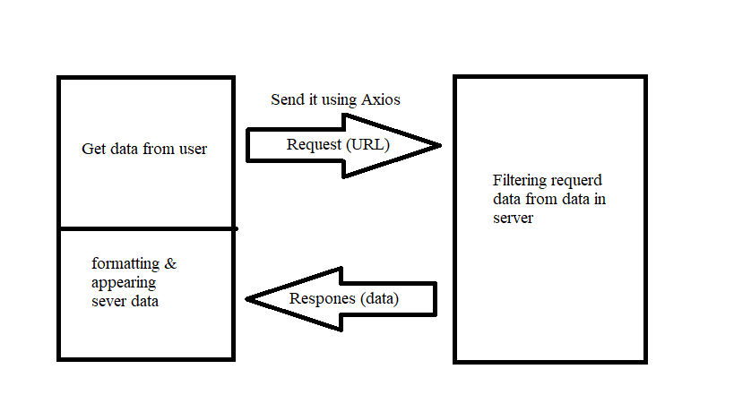

# Project Name

# city-explorer

**Author**: Yahia Labib
**Version**: 2.0.0

## What did we do today 

## Overview

This webpage designed to help people to get informations about any country or city they choose.

## Getting Started
<!-- What are the steps that a user must take in order to build this app on their own machine and get it running? -->

## Architecture
<!-- Provide a detailed description of the application design. What technologies (languages, libraries, etc) you're using, and any other relevant design information. -->

## Change Log

I used react, bootstrap, used Axios and Locationiq.com

## Credit and Collaborations

thanks to [locationiq](https://locationiq.com) to provide the data needed.

## [Live URL](city-finder.netlify.app)

## Time Estimates

### All feature of lab 06

Estimate of time needed to complete: 2 hours

Start time: 8: 45 pm

Finish time: 11:15 pm

Actual time needed to complete: 2:30 hours

### All feature of lab 07

Estimate of time needed to complete: 3 hours

Start time: 4:00 pm

Finish time:8:15 pm

Actual time needed to complete: 4:15 hours
